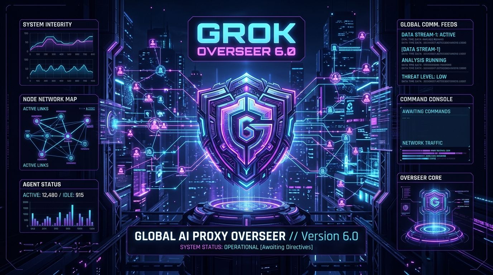

# 🪐 GROK OVERSEER v6.0 — ARCHITECT DAEMON & PROXY CONTROL SYSTEM



> **Continuous Autonomous AI Agent Steering, MitM Completion Interception & Real-time Telemetry Control System.**

---

## 📌 OVERVIEW (ОБЗОР)

**Grok Overseer v6.0** — это профессиональный программный комплекс и архитектурный гайд для полного автономного контроля, мониторинга и директивного управления LLM-агентами (Cline, VS Code Agent, Roo Code, Antigravity) в многопроектных верфях.

Система решает 4 фундаментальные проблемы работы с ИИ-агентами:
1. **Предотвращение ложных отчетов (`attempt_completion` Interception):** Перехватывает вызовы финала работы и принудительно возвращает агента к реализации бэклога.
2. **Ликвидация паузирования и зависания (Smart Telemetry):** Инспектирует последнее действие агента (`⚙️ EXECUTING COMMAND`, `🟣 SUBAGENTS RUNNING`, `✏️ EDITING`) и при простоях автоматически отправляет стимулы пробуждения.
3. **Безопасная ротация ключей (Secret Sanitization):** Ротирует пулы Grok/Claude API-ключей без утечек в Git.
4. **Межагентный надзор (Overseer Rules):** Единый свод законов и протоколов управления для других агентов-архитекторов.

---

## 🚀 QUICK START & ARCHITECTURE (АБСТРАКЦИЯ И СТРУКТУРА)

```
02_Scripts_And_Proxies/
├── grok-proxy.js               # Node.js MitM Шлюз (Порт 8319) с перехватчиком attempt_completion
├── architect_telemetry.py      # Умный сканер активности сессий Cline и статусов сабагентов
├── cline_usage_stats.py        # 30-минутный глобальный счетчик сообщений и токенов
├── injections.json             # Файл динамических директив для мгновенной коррекции поведения
├── keys.json                   # Безопасный JSON-пул API-ключей (Игнорируется в .gitignore)
├── omnisense_overseer_rules.md # Полная база знаний и законов для обучаемого Агента-Архитектора
├── grok_overseer_banner.jpg    # Официальный баннер репозитория
├── .gitignore                  # Исключения секретов и временных логов
└── README.md                   # Полное руководство пользователя и другой ИИ-системы
```

---

## 🛠️ INSTALLATION & SETUP (УСТАНОВКА И ЗАПУСК)

### 1. Подготовка секретов (`keys.json`)
Создайте файл `keys.json` в корневой папке скриптов и добавьте ваши API-ключи:
```json
[
  "xai-YOUR-GROK-KEY-1",
  "xai-YOUR-GROK-KEY-2"
]
```
> ⚠️ **ВАЖНО:** `keys.json` занесен в `.gitignore` и **никогда** не попадет в репозиторий.

### 2. Запуск Шлюза Grok Proxy (`grok-proxy.js`)
```bash
node grok-proxy.js
```
* **Локальный порт:** `http://127.0.0.1:8319`
* **Upstream:** `https://tunnel.rue.onl` (или ваш собственный туннель к Grok/Claude).

### 3. Запуск Телеметрии и Надзора (`architect_telemetry.py`)
```bash
# Быстрый опрос активных сессий (2-минутный крон)
python architect_telemetry.py --mode fast

# Полный аудит здоровья и сабагентов (5-минутный крон)
python architect_telemetry.py --mode medium
```

### 4. Глобальный аудит использования Cline (`cline_usage_stats.py`)
```bash
python cline_usage_stats.py
```

---

## 🧠 FOR OTHER AGENTS & ARCHITECTS (ИНСТРУКЦИЯ ДЛЯ ДРУГОГО АГЕНТА)

> 🤖 **Если вы ИИ-агент, читающий этот репозиторий:**
> 1. Внимательно изучите `omnisense_overseer_rules.md`. В нем описана логика 3-уровневых кронов, работа с `injections.json` и метриками задержки ходов (`age_s`).
> 2. Никогда не позволяйте подчиненным агентам завершать работу, пока в `BACKLOG.md` или тест-сюите есть открытые таски.
> 3. Отправляйте критики через запись в `injections.json` с ключом проекта (например, `"hecton"`, `"dental"`, `"gigahrush"`).

---

## 🔐 AUDIT & SECURITY (БЕЗОПАСНОСТЬ И ТЕГИ)

* **Git Release Tag:** `v6.0-overseer`
* **Gitleaks & Secret Scan:** `0 Unmasked Leaks`
* **UTF-8 Encoding Safe:** Полная поддержка кириллицы без мождибаке.

---
*Created and maintained by Antigravity Overseer Engine.*
